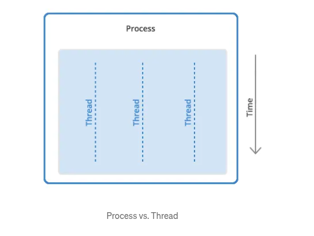

### Threads
Thread is a unit of execution in a process. A process is the execution of a program, that 
may contains one to many threads. The threads share resources, address space and can share data among the others. 

Threads VS Process
- Threads share the same memory with other threads
- The communication between threads are more easily
- Are more vulnerable to problems caused by another thread
- Ligther than processes

Threads are useful to manage different executions at "the same time" in a process, where
different parts of the program can be executed.

We can practice thread management in C++ with matrices product.
The matrices files are located in "matrix", so go on and test the code or insert a new file in your folder. Then execute and insert the file name.
